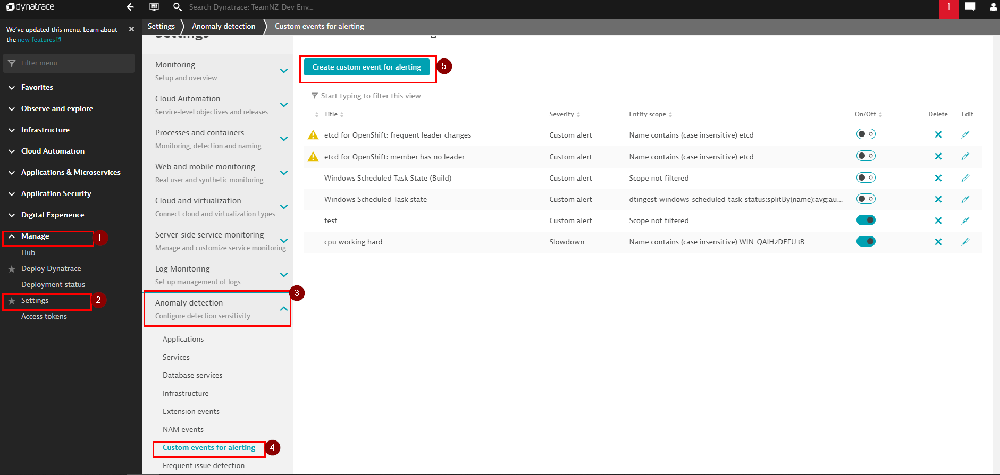
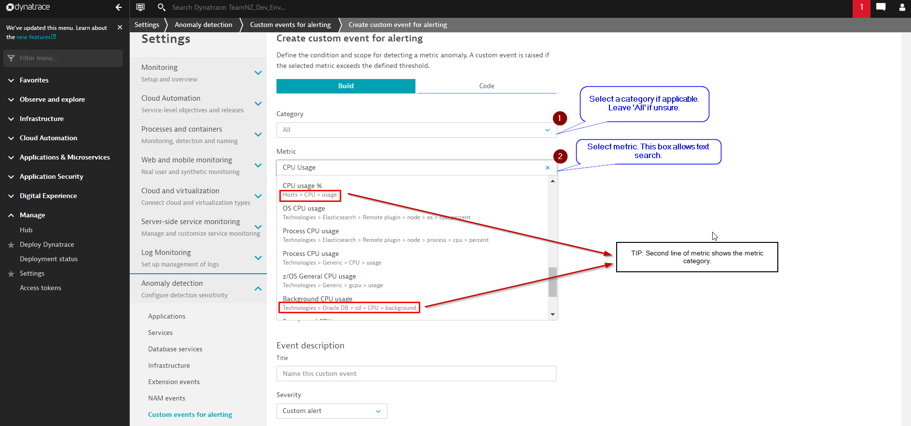
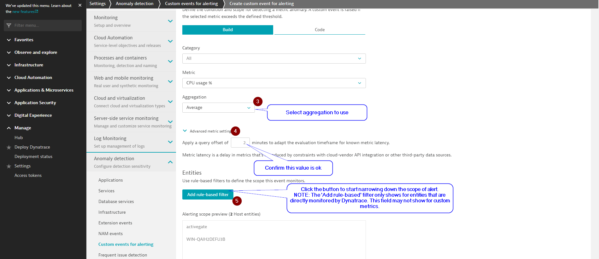
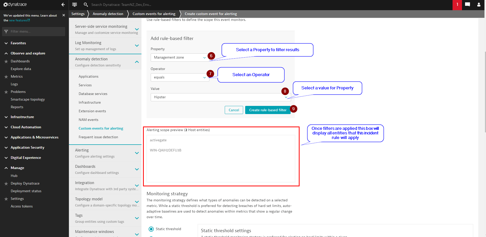
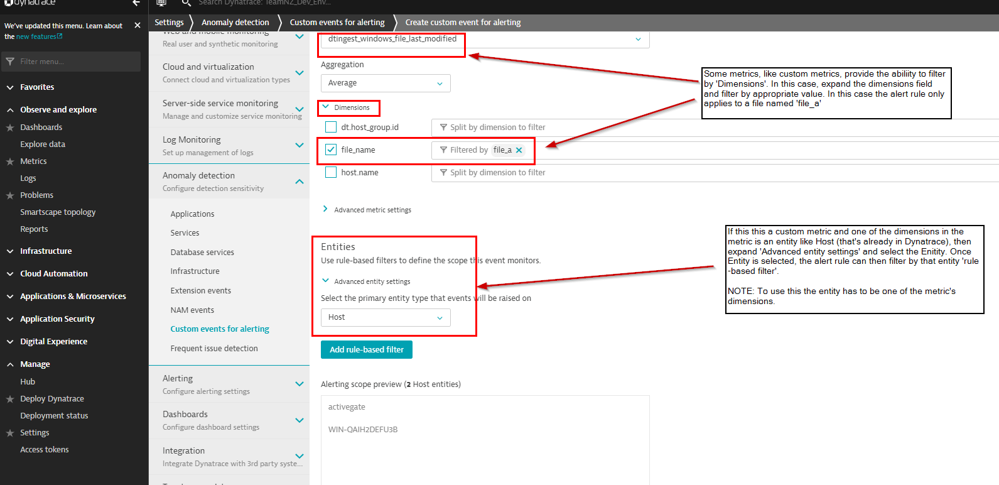
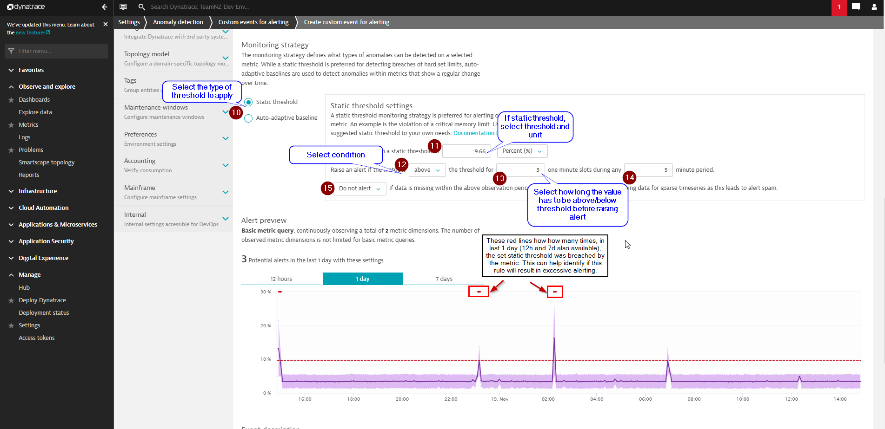
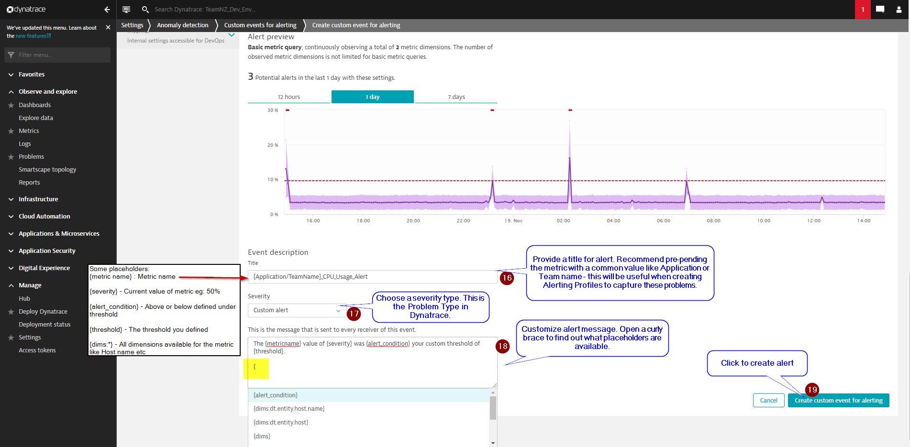

# Create Custom Event for Alerting rule

To create Custom Event for Alerting rule, navigate to `Manage > Settings > Anomaly detection > Custom events for alerting` and click `Create Custom event for alerting` .

 

## Steps to create rule:

1. Select metric

        

    

 

2. Filter results

    
 

    > TIP: For Custom Metrics

   - 

 

3. Select thresholds

    

 

4. Provide a name, customize message and create rule

    

 

The next steps is to create an Alerting Profile to capture this alert, whenever its created. 

## NEXT: [Create Alerting Profile](2_create_alerting_profile.md)

