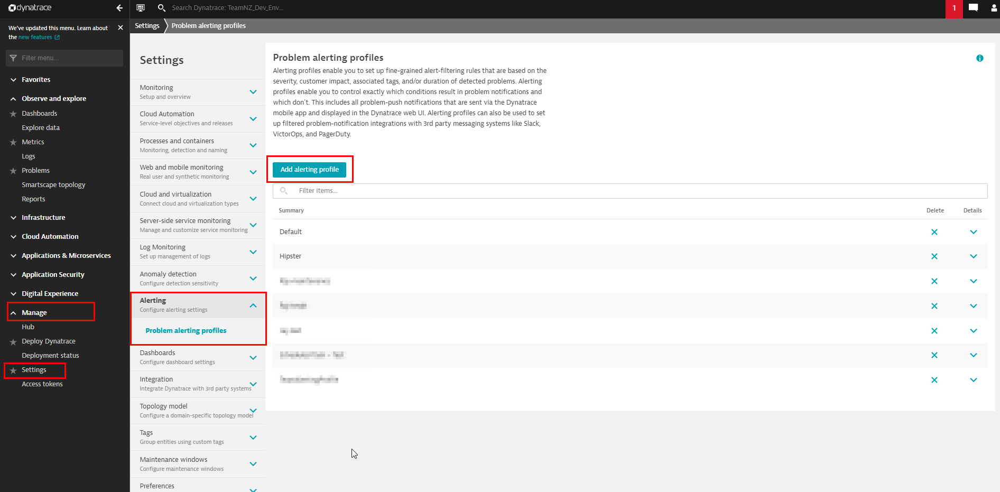
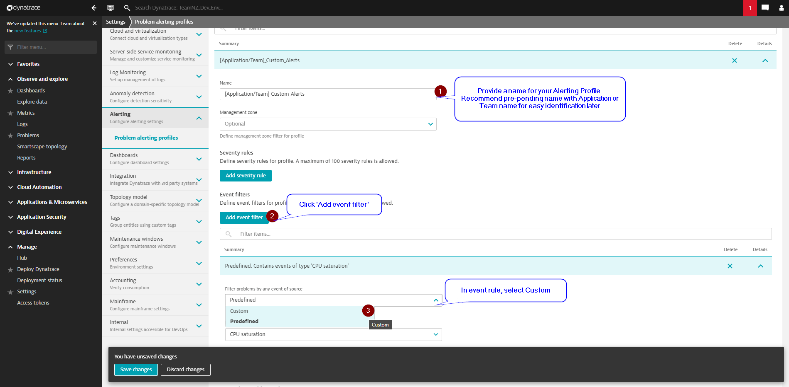
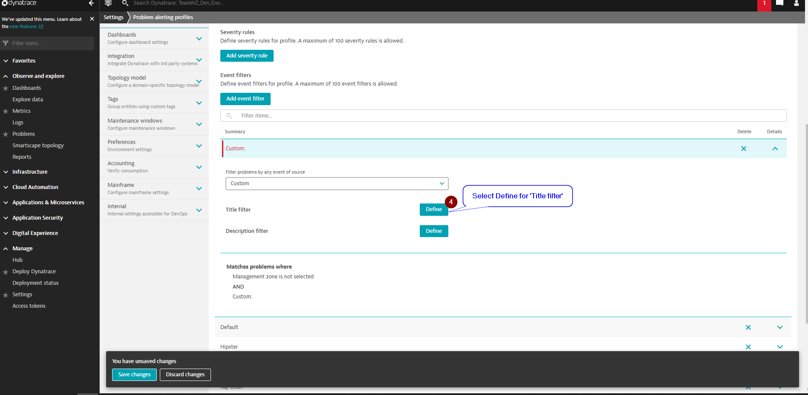
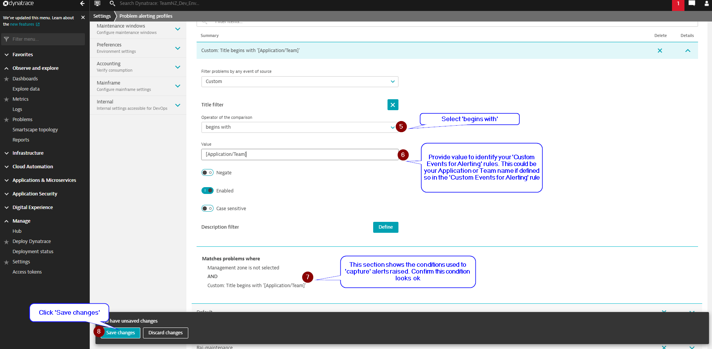
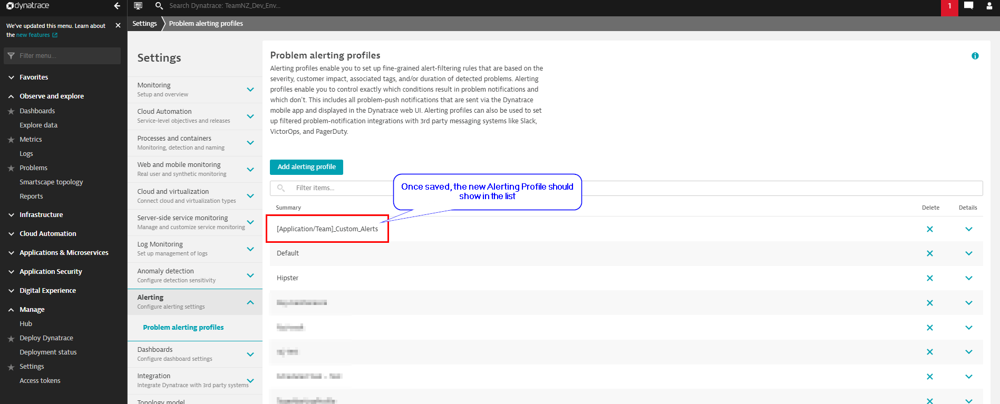

# Create Alerting Profile for Custom Alerts

To create an Alerting Profile navtigate to `Settings > Alerting > Problem Alerting Profiles` and click `Add alerting profile`

## Steps:

 

 

 

 

The next steps is to create a Problem notification rule to receive alert when the Alerting Profile is triggered.

## NEXT: [Create Alerting Profile](2_create_alerting_profile.md)
